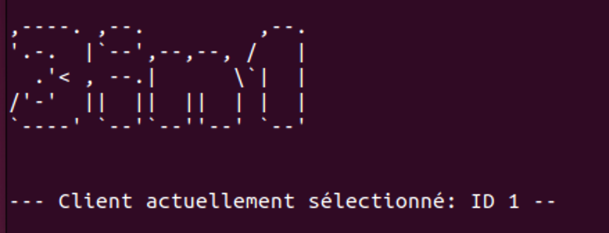

# 3in1 Malwares

## 🤖 Présentation du programme

Ce programme créé à titre pédagogique permet de comprendre le fonctionnement de 3 types de logiciel malveillants codé en language C.

## 👨‍💻 Spécificités techniques

- **Contrôler jusqu'à 10 machines linux/macos simultanément** : Nous avons intégré une fonctionnalité permettant d'ajouter jusqu'à 10 machines et d'executer des types de logiciels malveillants.

- **3 malwares disponibles** : Forkbomb (programme se reproduisant rapidement pour surcharger et paralyser un système informatique), extraction de données (récupération de données sensibles exemple fichier /etc/passwd), ransomware (logiciel malveillant qui chiffre les fichiers d'un utilisateur et exige une rançon pour leur déverrouillage)

## 🦠 Spécificités des malwares

### Forkbomb

- Bloquage des raccourcis *Ctrl + Z* et *Ctrl + C*
- Persistance au démarrage via un service
- Réouverture du programme en cas de fermeture
### Extraction de données

- Récupération du fichier /etc/passwd et enregistrement du passwd dans le dossier racine de l'excutable du serveur (attaquant)
### Ransomware

- Chiffrement AES
- Bloc-note avec les instructions à suivre pour déchiffrer les données

## ⚠️ Exemples d'utilisation

## 📝 Configuration en amont

1 - Modifier le fichier client pour renseigner l'IP du serveur (attaquant)

2 - Installer les librairies où vous allez compiler les 2 programmes :

> sudo apt-get update && sudo apt-get install build-essential && sudo apt-get install libssl-dev

3 - Compiler le fichier client à l'aide de gcc

> gcc client.c -o client -lssl -lcrypto

4 - Compiler le fichier serveur :

> gcc server.c -o server

Attention le client doit être executé en sudo (sinon tous les malwares ne fonctionneront pas correctement)

> sudo ./client

## 🎯 Utilisation du programme

1 - 
